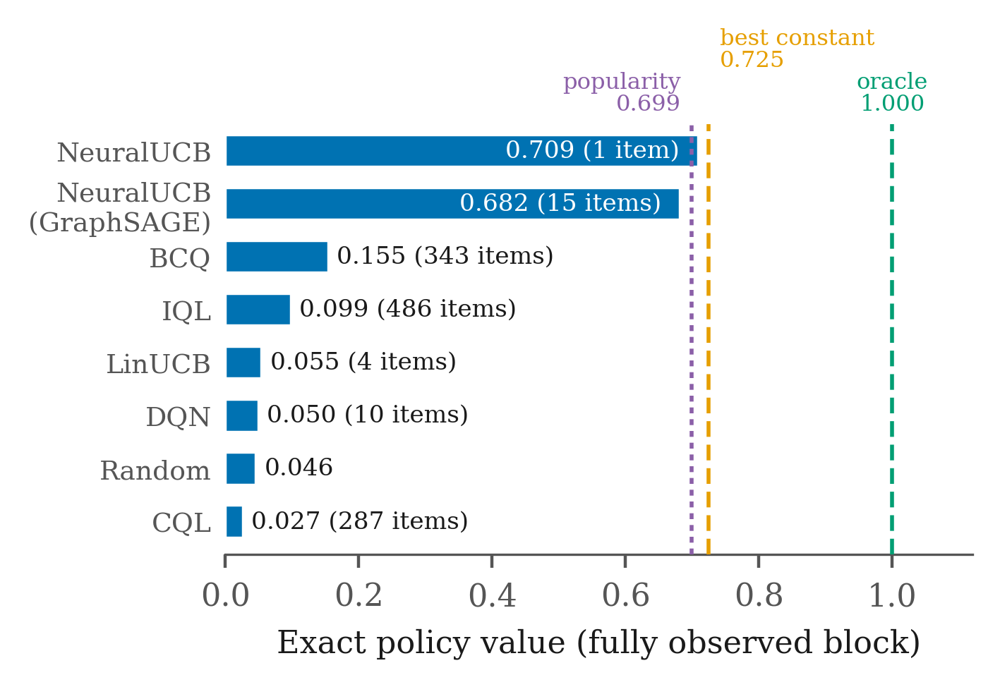
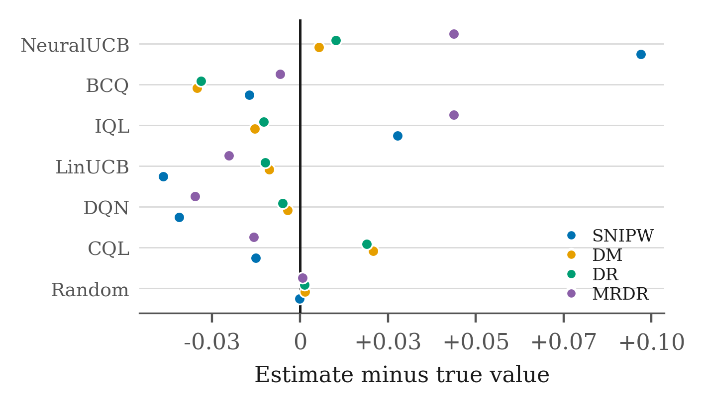

# Graph-Enhanced Causal Reinforcement Learning for Prescriptive Recommendation

Reference implementation and experimental results for *"Graph-Enhanced Causal
Reinforcement Learning for Proactive Customer Retention: A Comparative
Benchmark"* (iCACCESS 2026).

The pipeline composes three stages that are usually studied separately: a graph
neural network for state representation, causal uplift estimation, and offline
reinforcement learning. It is evaluated on two datasets with complementary
evaluation properties, one providing logged propensities and one providing a
fully observed reward matrix, so that estimated policy values can be compared
against ground truth.

## Summary of findings

- **No learned policy exceeds a single well-chosen item.** On KuaiRec, whose
  evaluation matrix is fully observed, the best agent attains an exact policy
  value of 0.709, against 0.725 for the best constant policy and 0.699 for a
  popularity heuristic derived from the training log alone.
- **The highest-scoring agent is itself a constant policy.** NeuralUCB
  recommends a single video to all 1,411 evaluation users, yet self-normalized
  importance weighting ranks it 17.4 times above a random policy.
- **No policy demonstrates personalization.** A permutation test over the
  assignment of items to users cannot distinguish any policy from a random
  reassignment of its own selections (smallest p = 0.144 across both state
  representations).
- **The reward label is closely determined by item duration** (Spearman
  rho = -0.954 over 3,306 items), which bounds what any method evaluated
  against it can be said to have learned.
- **Causal reward shaping improves no agent**, and the graph encoder with the
  stronger link-prediction fit yields the weaker policy.
- **Estimator accuracy tracks action overlap rather than estimator
  sophistication.** Against exact ground truth, the direct method and doubly
  robust estimation are approximately 2.7 times more accurate than
  self-normalized importance weighting.

Each figure above is reproduced by the code in this repository from the result
files in `results/`.

## Results at a glance

Both figures are generated from `results/` by
[`scripts/make_figures.py`](scripts/make_figures.py); neither contains a
transcribed number.



*Exact policy value on KuaiRec's fully observed block. Dashed rules mark the
three reference policies. No agent exceeds the best constant policy, and the
highest-scoring agent selects a single item for all 1,411 users.*



*Signed estimator error against exact ground truth. The direct method and
doubly robust estimation are roughly 2.7 times more accurate than
self-normalized importance weighting, and error tracks action overlap rather
than estimator sophistication.*

## Repository layout

```
gcrl/          core package: data loaders, GNN encoders, causal estimators,
               offline RL agents, off-policy estimators, and the four phases
configs/       experiment configurations; every reported run has one
scripts/       entry points, table and figure generation, diagnostic tooling
tests/         454 unit and integration tests covering the estimators, the
               loaders and the evaluation protocol
results/       the JSON and CSV files underlying the reported tables
docs/          reproduction instructions, figures, and a map from result
               file to claim
```

## Quick start

```bash
python -m venv .venv && . .venv/bin/activate      # Windows: .venv\Scripts\activate
pip install -r requirements.txt
pytest -q                                          # 454 tests, no data required
```

Reproducing the experiments requires both datasets and a CUDA-capable GPU. See
[`docs/REPRODUCING.md`](docs/REPRODUCING.md) for download locations,
phase-by-phase commands, and measured runtimes.

## Methodological notes

- **Single seed.** All reported results use seed 42, so point estimates should
  be read as indicative rather than precise. The structural findings, namely
  the duration correlation, the concentration of selected actions, and the
  permutation tests, are properties of the data or of within-run tests and do
  not depend on the seed.
- **Artefacts are fingerprinted.** Phase 1 encoders and Phase 2 CATE vectors
  are cached under a hash of every input that determines them, which prevents a
  configuration change from silently reusing a stale artefact.
- **Unobserved cells are masked rather than imputed.** An exact policy value is
  the mean over cells whose reward was recorded, and every result row reports
  the number of excluded rounds.
- **Large files are not tracked.** The raw datasets (`data/`, approximately
  10 GB) and trained artefacts (`artifacts/`) are excluded and regenerable; the
  result files derived from them are committed.

## Datasets

- [Open Bandit Dataset](https://research.zozo.com/data.html) (BTS subset):
  logged fashion e-commerce interactions with recorded propensities.
- [KuaiRec 2.0](https://kuairec.com/): short-video interactions with a
  user-user social graph and a fully observed evaluation matrix.

Neither dataset is redistributed here. Expected paths are given in
[`docs/REPRODUCING.md`](docs/REPRODUCING.md).

## Citation

```bibtex
@inproceedings{mahmud2026graphcausal,
  title     = {Graph-Enhanced Causal Reinforcement Learning for Proactive
               Customer Retention: A Comparative Benchmark},
  author    = {Mahmud, Kazi Tasfin and Latif, Md. Zarif and Muntaha, Sidratul
               and Banik, Puja and Aziz, Azwad and Chakrabarty, Amitabha},
  booktitle = {Proc. Int. Conf. on Advancement in Computation and Computer
               Science (iCACCESS)},
  year      = {2026}
}
```

## License

Released under the MIT License. See [LICENSE](LICENSE).
